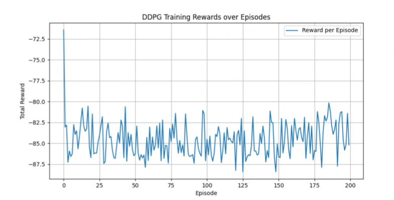

# Deep Deterministic Policy Gradient (DDPG) Implementation

Implementation of DDPG algorithm for continuous control in the CarRacing-v2 environment.

## Overview

This project implements the Deep Deterministic Policy Gradient (DDPG) algorithm, an extension of Deep Q-Networks (DQN) designed for continuous action spaces. DDPG combines actor-critic architecture with deterministic policy gradients and incorporates techniques from DQN.

### Key Components

**Actor-Critic Architecture:**
- **Actor Network** μ(s|θμ): Learns deterministic policy mapping states to continuous actions
- **Critic Network** Q(s,a|θQ): Estimates action-value function (expected return)

**Exploration:**
- Gaussian noise N(0, σ) added to actions during training

## Results

## References

- [DDPG Paper](https://arxiv.org/abs/1509.02971) - Lillicrap et al., 2016
- [Blog post on noise comparison](https://soeren-kirchner.medium.com/deep-deterministic-policy-gradient-ddpg-with-and-without-ornstein-uhlenbeck-process-e6d272adfc3)
