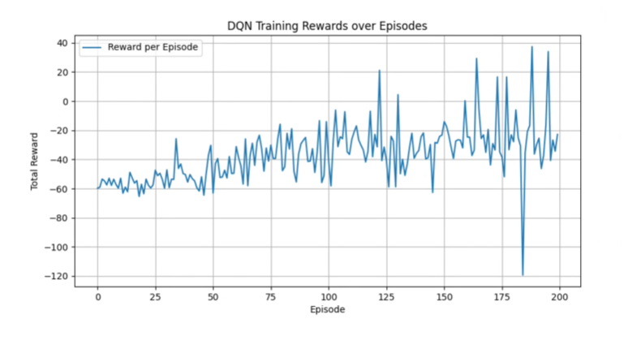

# Deep Q-Network (DQN) for CarRacing-v2

Implementation of Deep Q-Network from scratch based on the paper ["Playing Atari with Deep Reinforcement Learning"](https://arxiv.org/abs/1312.5602) by Mnih et al.

## Overview

DQN addresses three key challenges in combining deep learning with reinforcement learning:
1. **Delayed rewards** - Rewards are noisy and delayed by thousands of timesteps
2. **Correlated states** - Consecutive states are highly correlated
3. **Non-stationary distribution** - Data distribution changes as the agent learns

**Solution:** Combines Q-learning with experience replay using a CNN to approximate the Q-function.

## Architecture

- **Input:** 84×84×4 grayscale frames (4 stacked frames)
- **Conv Layer 1:** 16 filters, 8×8 kernel, stride 4
- **Conv Layer 2:** 32 filters, 4×4 kernel, stride 2
- **FC Layer 1:** 256 units
- **Output Layer:** 5 discrete actions

## Training Results

Trained for 200 episodes (~2 hours) on CarRacing-v2 environment.

**Key observations:**
- Initial rewards: ~-60
- Final rewards: ~-20 with occasional positive spikes
- Consistent learning pattern emerged after episode 150

## Key Implementation Details

- **Experience Replay:** Deque with 100,000 capacity
- **Batch Size:** 32
- **Learning Rate:** 0.0001 (Adam optimizer)
- **Gamma (discount factor):** 0.99
- **Epsilon decay:** 0.995 per episode (min 0.1)
- **Loss:** MSE

## References

- [Playing Atari with Deep Reinforcement Learning](https://arxiv.org/abs/1312.5602) - Mnih et al., 2013
- [PyTorch DQN Tutorial](https://pytorch.org/tutorials/intermediate/reinforcement_q_learning.html)
