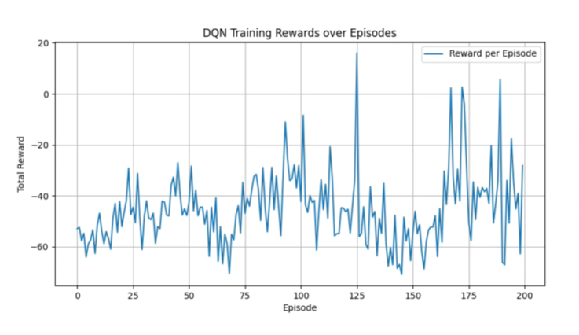
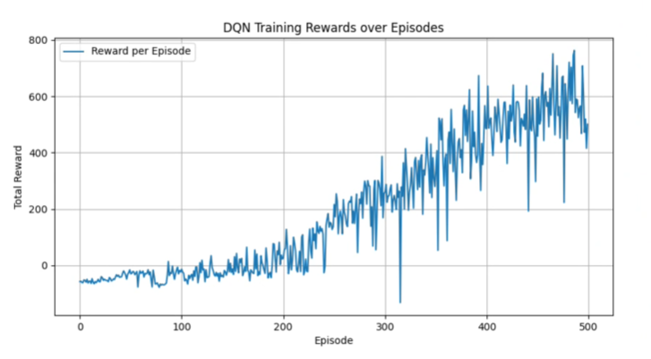

# Refined DQN Implementation for CarRacing-v2

Improved Deep Q-Network implementation with target network.

## Key Improvements

### 1. **Target Network**
Added a separate target network as specified in the original DQN paper to stabilize training.

**Problem with baseline DQN:**
- Target value: target = reward + γ * max(Q(next_state, next_action))
- Both prediction and target come from the **same network**
- Creates feedback loop: when weights change, both outputs and targets shift simultaneously
- Like trying to hit a moving target that moves every time you adjust your aim

**Solution:**
- Separate **target network** with frozen weights
- Updated every 1,000 steps to match main network
- Provides stable, consistent learning targets

### 2. **Learning Rate Tuning**
Experimented with different learning rates to find optimal training speed:
- Baseline: lr = 0.0001
- Tested: lr = 0.00025 (faster but unstable)
- **Final choice: lr = 0.0001** (stable + consistent improvement)

### 3. **Extended Training**
Increased episodes from 200 to 500

## Training Results

### DQN with lr = 0.00025 (200 episodes, with target network)

### Improved DQN lr = 0.0001 (200 episodes, with target network)

### Improved DQN lr = 0.0001 (500 episodes, with target network)

## References

- [Playing Atari with Deep Reinforcement Learning](https://arxiv.org/abs/1312.5602) - Mnih et al., 2013
